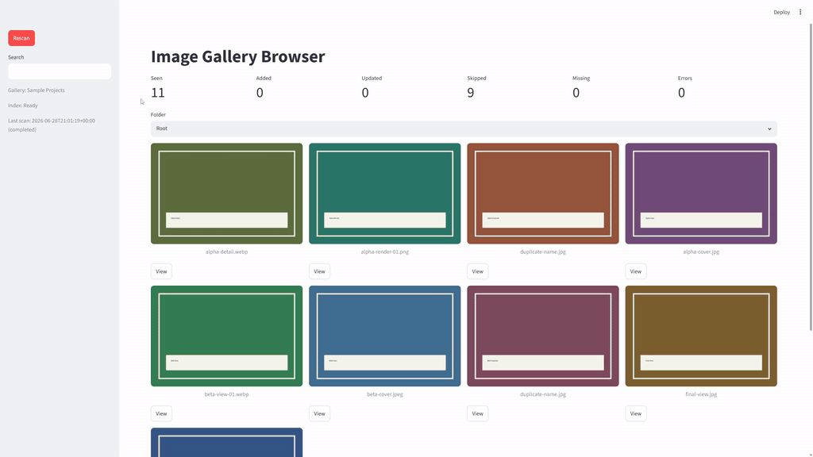

<h1 align="center">Image Gallery Browser</h1>

<p align="center">
Local image project browser with Streamlit, Pillow thumbnails, and SQLite
indexing.
</p>

<p align="center">
  
</p>

<p align="center">
Runtime demo: scan metrics, folder navigation, thumbnail browsing, and source
image preview.
</p>

## Features

- Scan the configured image root and all nested folders.
- Preserve folder names for gallery grouping and navigation.
- Store source image paths as root-relative POSIX paths.
- Generate cached thumbnails with Pillow.
- Store runtime data outside source image folders.
- Persist folders, image metadata, scan records, and recoverable errors in
  SQLite.
- Control resolved path and raw OS error display with `show_diagnostics`.
- Display large source-image previews from the gallery.

## Quick Start

```powershell
python -m venv .venv
.\.venv\Scripts\Activate.ps1
python -m pip install -r requirements.txt
streamlit run app.py
```

Open `http://localhost:8501`.

## Requirements

- Python 3.13+
- Streamlit
- Pillow
- SQLite

Install dependencies from the reviewed lock files in this repository.

## Configuration

Edit `config.example.json` for the local machine or deployment target. Commit
shared defaults only.

By default, `app.py` reads `config.example.json` from its own folder instead of
the shell working directory. Separate copied deployment folders can point to
different relative image roots and data directories.

Set `IMAGE_GALLERY_CONFIG` to load a different JSON file. Relative override
paths resolve from the shell working directory. Paths inside the selected JSON
file resolve from that JSON file's folder.

Maintain `config.example.json` as valid JSON. The annotated example below
documents each field.

```jsonc
{
  "projects_root": "sample_projects", // Set the image root folder or UNC share.
  "data_dir": "data", // Store SQLite data and thumbnail cache files.
  "gallery_label": "Sample Projects", // Display a public gallery name.
  "thumbnail_size": [320, 320], // Limit generated thumbnail width and height.
  "supported_extensions": [".jpg", ".jpeg", ".png", ".webp"], // Scan these image suffixes.
  "auto_scan_on_empty": true, // Run the first scan when the index has no data.
  "max_images_per_view": 200, // Limit images returned for one gallery view.
  "show_diagnostics": false // Set true to show resolved paths and raw OS error details.
}
```

Relative path configuration for portable local setups:

```json
{
  "projects_root": "sample_projects",
  "data_dir": "data"
}
```

Absolute path or UNC share configuration for Windows Server deployments:

```json
{
  "projects_root": "\\\\SERVER\\Share\\ImageProjects",
  "data_dir": "D:\\GalleryData"
}
```

Set `gallery_label` for public deployments. Set `show_diagnostics` to
`false` for shared screens, hosted demos, and public access.

Set `data_dir` outside `projects_root`. Configuration loading rejects nested
data directories so generated thumbnails and SQLite files cannot be scanned as
source images.

## Sample Data

`sample_projects/` supports local checks and screenshots. The sample folder
contains root-level images, nested project folders, supported image formats,
duplicate filenames in different folders, files with spaces in parent paths,
and unsupported text files.

Run `Rescan` in the sidebar after changing sample files.

## Data Storage

`data/gallery.sqlite3` stores roots, folders, images, scans, and scan errors by
default.

`data/thumbnails/` stores PNG thumbnails named from SHA-256 hashes of
source-relative paths and configured thumbnail size. Same-named files in
different folders receive different thumbnail files. Thumbnail size changes
create separate cache files.

Git ignores runtime data under `data/`.

## Windows Server

Run Streamlit with an explicit address and port:

```powershell
streamlit run app.py --server.address 0.0.0.0 --server.port 8501
```

Set `projects_root` to a local folder or UNC share readable by the service
account. Set `data_dir` to a writable local folder outside the image source
tree.

Set `gallery_label` to a public display name. Set `show_diagnostics` to
`false`.

Limit network access with the server firewall, a private network, or a reverse
proxy.

Run separate deployment directories when one server hosts multiple galleries.
Each directory can pair its own `app.py`, `config.example.json`, and relative
runtime data folder.

Set an explicit configuration file for one process:

```powershell
$env:IMAGE_GALLERY_CONFIG = "D:\GalleryConfigs\client-a.json"
streamlit run "D:\Apps\image-gallery-browser\app.py" --server.address 0.0.0.0 --server.port 8501
```

## Supported Images

Default extensions:

- `.jpg`
- `.jpeg`
- `.png`
- `.webp`

Pillow reads image dimensions, applies EXIF orientation, and writes cached PNG
thumbnails.

## Development

Enable the repository hook before committing:

```powershell
git config core.hooksPath .githooks
```

Run focused checks during development:

```powershell
python -m pytest
python -m ruff check .
python -m ruff format --check .
python scripts/check_links.py
python scripts/check_text_files.py --staged
```

## Architecture

Read [docs/ARCHITECTURE.md](docs/ARCHITECTURE.md) for module responsibilities,
data flow, scan orchestration, path handling, SQLite persistence, UI behavior,
and test coverage.

## License

MIT
