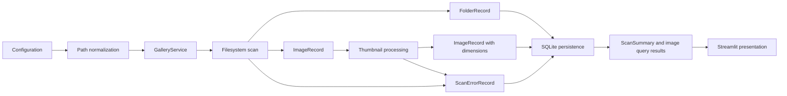

# Architecture

Image Gallery Browser keeps filesystem discovery, image processing, SQLite
persistence, scan orchestration, path handling, and presentation entry code in
separate modules. Core modules exchange typed dataclass records and run without
a Streamlit runtime.

## Module Responsibilities

`config.py` loads JSON configuration, applies defaults, and returns a
normalized `GalleryConfig`.

`app.py` configures the Streamlit page, loads configuration, creates
`GalleryService`, and delegates rendering to the UI package.

`paths.py` resolves configured paths, converts source paths to POSIX-style
root-relative paths, validates root boundaries, and detects UNC path strings.

`models.py` defines immutable records shared across modules, including
`GalleryConfig`, `FolderRecord`, `ImageRecord`, `ScanErrorRecord`,
`ScanSummary`, `ScanRecord`, and `FilesystemScanResult`.

`errors.py` defines stable scan stages and error categories.

`scanner.py` walks the configured root, records folders, records supported
image files, and returns recoverable filesystem errors.

`thumbnails.py` opens images with Pillow, applies EXIF orientation, reads image
dimensions, generates cached thumbnails, and returns updated `ImageRecord`
values.

`services.py` coordinates root identity, empty-index scan checks, manual
rescans, thumbnail processing, SQLite writes, missing record marking, and
bounded image reads.

`database/__init__.py` exposes `GalleryDatabase` and coordinates schema
initialization, root upsert, folder upsert, image upsert, missing status
updates, scan records, scan errors, and query methods.

`database/schema.py` stores schema version, table name allowlists, and schema
SQL.

`database/queries.py` stores SQL statements and query builders.

`database/records.py` converts SQLite rows into domain records and classifies
image upsert results.

`database/support.py` opens SQLite connections, creates data directories,
normalizes root paths, hashes root paths, formats timestamps, and escapes LIKE
patterns.

`ui/__init__.py` renders the main Streamlit page, runs the initial empty-index
scan once per Streamlit session, handles the `Rescan` action, and displays scan
summary metrics.

`ui/folder_tree.py` builds indented folder labels and renders the folder
selector.

`ui/gallery.py` renders the bounded thumbnail grid and returns the selected
image from a `View` button.

`ui/preview.py` renders large image preview content, metadata, and the
source-relative path field.

## Data Flow



Configuration produces normalized root and data paths. `GalleryService` creates
or reuses the configured root record, runs scans, enriches discovered images
through thumbnail processing, writes scan outputs, and returns bounded read
results for presentation code. SQLite persistence stores roots, folders, images,
scan runs, and recoverable errors.

## Configuration

`config.example.json` defines:

- `projects_root`
- `data_dir`
- `gallery_label`
- `thumbnail_size`
- `supported_extensions`
- `auto_scan_on_empty`
- `max_images_per_view`
- `show_diagnostics`

Relative configuration paths resolve from the configuration file directory.
Supported extensions normalize to lowercase values with leading dots.
Thumbnail size requires two positive integers. `gallery_label` supplies the
short public label used by the UI. `show_diagnostics` controls whether resolved
filesystem paths and raw error messages appear in the Streamlit interface.

## Path Handling

Source image paths use POSIX separators in records and SQLite rows. Windows
paths and UNC path strings enter through configuration and filesystem APIs, then
convert to stable source-relative values.

The root folder uses `.` as the stored relative path marker.

Examples:

- `render.png`
- `Project A/render.png`
- `Project A/Renders/view.webp`

`relative_to_root()` rejects paths outside the configured root before storage.
`source_image_path()` rejects empty values, `.`, absolute paths, and parent
traversal segments before opening source images. Thumbnail cache paths reject
absolute paths and parent traversal segments before joining with `data_dir`.

## Filesystem Scan

`scan_gallery_root()` scans the configured root and every child directory. It
does not depend on folder names.

Each discovered folder produces:

- `relative_path`
- `name`
- `parent_relative_path`
- `depth`

Each supported regular image file produces:

- `source_relative_path`
- `folder_relative_path`
- `filename`
- `extension`
- `file_size`
- `modified_time`

The scanner uses `Path.stat(follow_symlinks=False)` and does not follow
symlinks. Permission errors, invalid paths, and OS errors become
`ScanErrorRecord` values.

## Thumbnail Cache

`process_image_thumbnail()` opens a source image with Pillow, applies EXIF
orientation, reads dimensions, checks cache freshness, and writes a PNG
thumbnail when needed.

Thumbnail files use this cache path:

```text
<data_dir>/thumbnails/<sha256(source_relative_path)>.png
```

The hash input uses the source-relative POSIX path. Same-named files in
different folders produce different thumbnail filenames.

Cache reuse compares thumbnail modified time with source image modified time.
Thumbnail writes stay under `data_dir`.

Image open failures map to `image_open` errors. Thumbnail generation and write
failures map to `thumbnail` errors.

## Scan Orchestration

`GalleryService` owns the application-level workflow around scanning and reads.
It uses `<data_dir>/gallery.sqlite3` as the default database path.

`scan_on_empty()` runs a scan only when `auto_scan_on_empty` is enabled and the
configured root has no indexed folders or images.

`rescan()` creates a running scan row, calls the filesystem scanner, processes
each discovered image through the thumbnail module, persists folders and images,
marks absent images and folders as missing, stores recoverable errors, and
finishes the scan with aggregate counts.

Unexpected scanner exceptions produce failed scans with a `scan` stage error.
Unexpected persistence exceptions produce failed scans with a `database` stage
error. Per-image thumbnail and image-open errors remain recoverable and do not
stop the rest of the scan.

Errored image files keep their source metadata and receive `error` status after
the associated scan error is stored. A later successful scan restores active
status through the normal image upsert path.

`list_images()` fetches one extra row beyond `max_images_per_view` to report
truncation while returning only the configured display limit.

## Presentation Layer

`app.py` imports Streamlit inside `main()`, sets the page title and layout,
loads `config.example.json` by default, reports configuration errors in the UI,
and opens `GalleryService` as a context-managed dependency.

The UI package receives a Streamlit module object and a `GalleryService`
instance. Presentation functions call service methods for scans, folders,
images, thumbnail paths, source paths, and latest scan metadata.

The sidebar displays:

- gallery label
- index status
- latest scan timestamp and status
- `Rescan` button
- search input

The default sidebar displays short public labels only. `Index` status uses the
latest scan status and the empty-index check:

- `Empty`
- `Ready`
- `Ready with errors`
- `Failed`
- `Scanning`

When `show_diagnostics` is enabled, the sidebar adds `Configuration details`
with the resolved root path and SQLite database path.

`render_app()` stores one Streamlit session key for the initial empty-index scan
attempt. This prevents repeated automatic scans during normal Streamlit reruns.

Folder selection uses labels from `build_folder_options()`. The root folder
displays as `Root`; child folders use two spaces per depth level.

`render_gallery()` lays out thumbnails in four columns. It displays a warning
when the service reports truncation at `max_images_per_view`. Each thumbnail
uses a `View` button to request large preview rendering.

`render_image_preview()` uses `st.dialog` when the active Streamlit runtime
provides it. The fallback renders the same preview content in the page body.
Preview content includes the source image, source-relative path, filename,
dimensions, file size, modified time, and status.

`render_scan_summary()` displays scan counters as metrics and renders
recoverable errors inside an expander.

Default error rows show only stage, error type, and source-relative path.
Diagnostic mode also displays the stored error message, which can contain
operating-system details from lower-level exceptions.

## SQLite Persistence

`GalleryDatabase` enables SQLite foreign keys and initializes schema version
`1`.

### `schema_meta`

Fields:

- `key`
- `value`

Initial row:

- `schema_version = 1`

### `roots`

Fields:

- `id`
- `name`
- `root_path`
- `root_path_hash`
- `root_label`
- `created_at`
- `updated_at`

Constraint:

- `UNIQUE(root_path_hash)`

`root_path_hash` uses SHA-256 over the normalized root path.

### `folders`

Fields:

- `id`
- `root_id`
- `relative_path`
- `name`
- `parent_relative_path`
- `depth`
- `status`
- `first_seen_at`
- `last_seen_at`

Constraint:

- `UNIQUE(root_id, relative_path)`

Statuses:

- `active`
- `missing`

### `images`

Fields:

- `id`
- `root_id`
- `folder_id`
- `source_relative_path`
- `filename`
- `extension`
- `file_size`
- `modified_time`
- `width`
- `height`
- `thumbnail_relative_path`
- `status`
- `first_seen_scan_id`
- `last_seen_scan_id`
- `created_at`
- `updated_at`

Constraint:

- `UNIQUE(root_id, source_relative_path)`

Statuses:

- `active`
- `missing`
- `error`

`upsert_image()` returns `added`, `updated`, or `skipped`. The skip decision
uses folder id, file size, modified time, dimensions, thumbnail path, and active
status.

`mark_image_error()` sets `error` status for a seen image without deleting its
metadata.

### `scans`

Fields:

- `id`
- `root_id`
- `started_at`
- `finished_at`
- `status`
- `total_files_seen`
- `images_added`
- `images_updated`
- `images_skipped`
- `images_missing`
- `errors_count`

Statuses:

- `running`
- `completed`
- `completed_with_errors`
- `failed`

### `scan_errors`

Fields:

- `id`
- `scan_id`
- `stage`
- `relative_path`
- `error_type`
- `message`
- `created_at`

Rows return in insertion order for a scan.

`get_latest_scan()` returns the newest scan metadata for the configured root.

## Query Behavior

`list_folders()` returns folders ordered by hierarchy depth and relative path.

`list_images()` returns images ordered by source-relative path. Folder queries
include descendant folders by default.

Search filters match filename and source-relative path with escaped SQLite LIKE
patterns. Dynamic table and key-column interpolation uses internal allowlists.

Missing folder and image handling updates status values instead of deleting
rows.

`GalleryService.list_images()` applies `max_images_per_view` and reports whether
additional matching rows exist.

## Error Taxonomy

Stages:

- `scan`
- `path`
- `image_open`
- `thumbnail`
- `database`

Error types:

- `permission_denied`
- `invalid_path`
- `corrupt_image`
- `unsupported_image`
- `thumbnail_failed`
- `database_error`
- `unknown_error`

Recoverable errors use `ScanErrorRecord` and persist through
`GalleryDatabase.add_scan_error()`.

## Test Coverage

Automated tests cover:

- configuration defaults and validation
- root-relative POSIX path conversion
- root boundary rejection
- UNC path detection
- recursive filesystem scanning
- root folder image assignment
- unsupported file filtering
- recoverable scanner errors
- SQLite schema initialization
- root hash deduplication
- folder and image upsert behavior
- missing folder and image marking
- descendant folder image queries
- scan status and scan error persistence
- latest scan metadata reads
- thumbnail hash naming
- thumbnail cache reuse
- corrupt image handling
- thumbnail write failure handling
- invalid source-relative image paths
- JPG, JPEG, PNG, and WebP thumbnail processing
- empty-index automatic scan checks
- scan orchestration across scanner, thumbnails, and SQLite
- unchanged image skip accounting
- missing image accounting
- recoverable per-image error persistence
- failed scan recording for scanner exceptions
- bounded image query truncation
- Streamlit entry configuration loading
- folder selector label generation
- thumbnail grid row chunking
- preview metadata formatting
